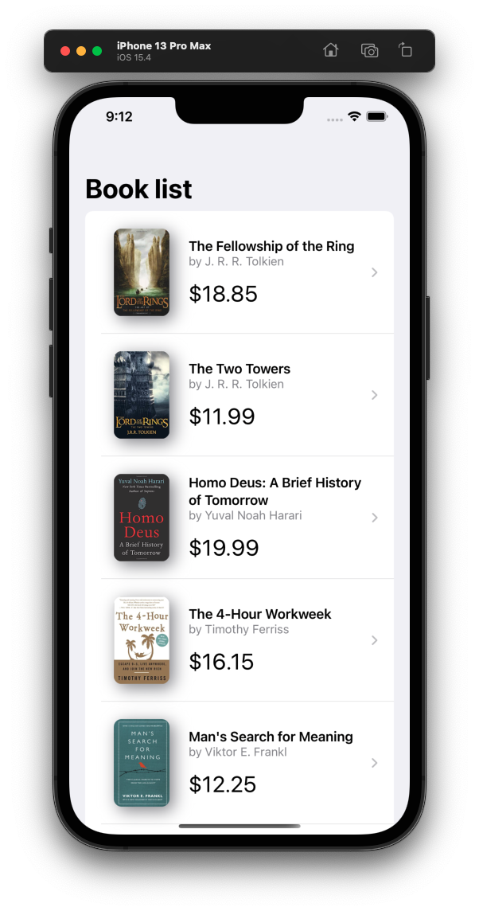
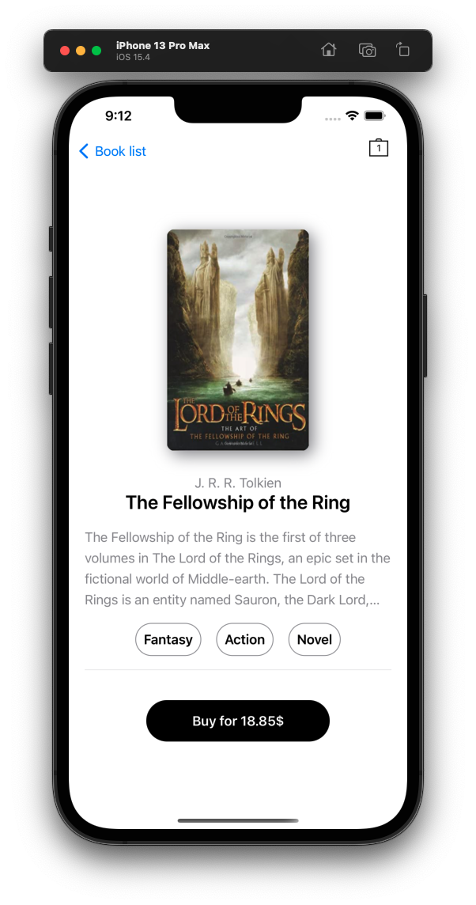
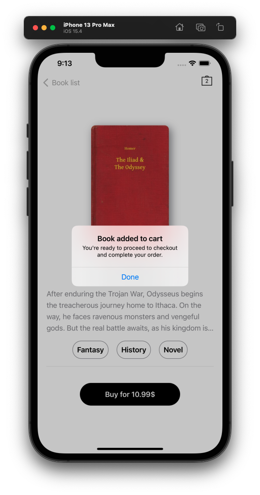
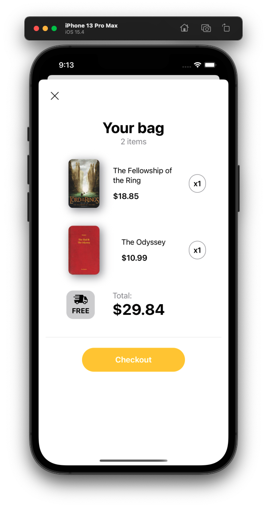

# SwiftUI-Academy
- Course about SwiftUI
- By: Javier Garcia, Mobile Developer.

## Challenge
- You need to design 3 screens according to the given template in the workshop:
- Book List
- Book Details
- Shop Cart.






## Criteria of acceptance
- Create the Book List Screen
- Create the Book Details Screen
- Create the Shop Cart Screen
- Upload your changes

## Instructions
- Clone the project
- Create a branch following this structure: ``` challenge/design/[FullName] ``` example ``` challenge/design/JavierGarcia``` 
- Push all your changes in your own branch